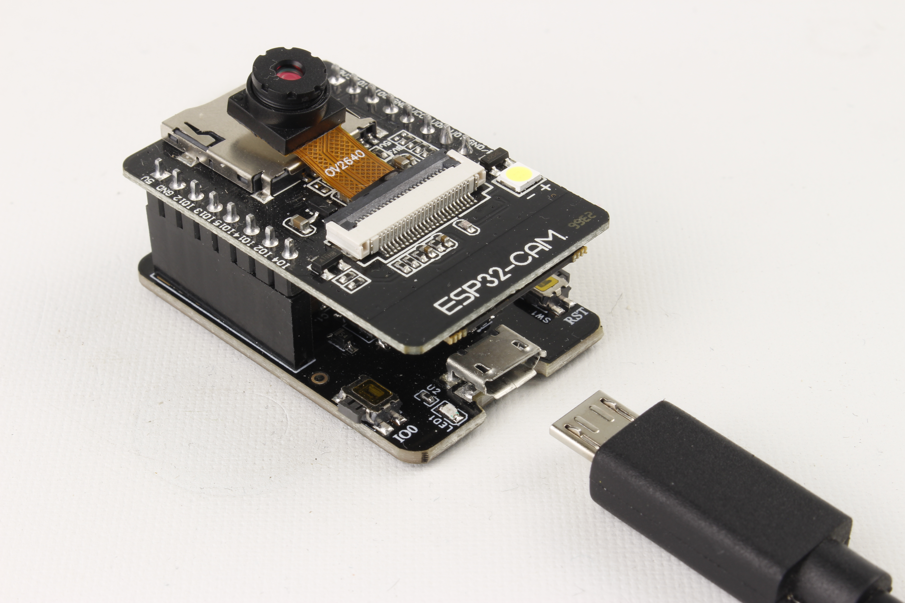

Maker Media GmbH

***

# ESP32-CAM-Hacks

## Ein Make-Projekt mit der ESP32-CAM

Bei der Arbeit mit der ESP32-CAM für das Make Special zu diesem Board haben wir eine Menge herausgefunden, was hoffentlich bei eigenen Projekten und Experimenten mit diesem Mikrocontroller-Board hilft. Hier der Code zur Handvoll Tipps, Tricks und Hacks für spezielle Fälle im Heft. 

Hier gibt es den Code im Ordner _src_.

Der vollständige Artikel zu den Hacks steht im **Make-Special ESP32-CAM 2023** ab Seite 60.
